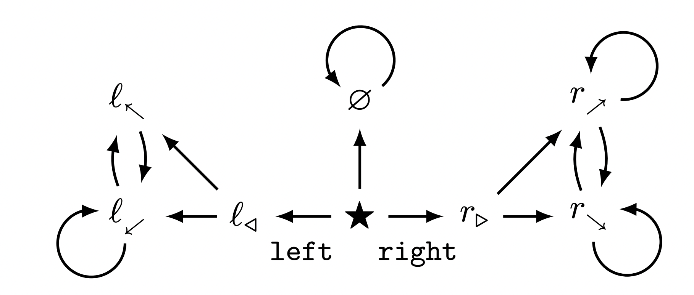

# POWER experiments

(Work in progress.)

Reference paper: _[Optimal policies tend to seek power](https://arxiv.org/pdf/1912.01683v7.pdf)_.

Investigation of the following MDP (Figure 1 from the paper):



## Installation, setup, and testing

👉 _This repo will only work with Python 3._

1. Ensure Homebrew and Graphviz are installed to enable MDP visualization. Run:
  
    ```
    % /bin/bash -c "$(curl -fsSL https://raw.githubusercontent.com/Homebrew/install/HEAD/install.sh)"
    ```

    ```
    % brew install graphviz
    ```

2. Activate `virtualenv`. Run:

  ```
  % python3 -m venv venv
  % source venv/bin/activate
  ```

3. Ensure pip is up to date and download required packages. Run:

  ```
  % pip install --upgrade pip
  % pip install -r requirements.txt
  ```

4. Create a W&B account if you don't have one already. Then create a file in the main directory called `settings.json` with the following format:

```
{
    "public": {
      "WANDB_DEFAULT_ENTITY": $YOUR_WANDB_USERNAME,
    }
    "private": {
        "WANDB_API_KEY": $YOUR_WANDB_KEY
    }
}
```

5. Run the `test()` function that will calculate the POWER for each state in the MDP whose `dot` format graph is stored in `mdps/mdp_from_paper.gv`, plot the results, and post them to W&B. Run:

  ```
  % python -i main.py
  ```

  Then:

  ```
  >>> experiment = test()
  ```

6. Confirm that the output you get is consistent. You should see something like:

  ```
    wandb: Currently logged in as bob-bobson (use `wandb login --relogin` to force relogin)
    wandb: Starting wandb agent 🕵️
    2021-11-23 11:15:03,014 - wandb.wandb_agent - INFO - Running runs: []
    2021-11-23 11:15:03,340 - wandb.wandb_agent - INFO - Agent received command: run
    2021-11-23 11:15:03,341 - wandb.wandb_agent - INFO - Agent starting run with config:
            mdp_graph: mdp_from_paper
            convergence_threshold: 0.0001
            discount_rate: [0.1, '0p1']
            num_reward_samples: 10000
            num_workers: 10
            random_seed: None
            reward_distribution: {'default_dist': {'dist_name': 'uniform', 'params': [0, 1]}, 'state_dists': {'ℓ_◁': {'dist_name': 'uniform', 'params': [-2, 0]}, '∅': {'dist_name': 'uniform', 'params': [-1, 1]}}}
    2021-11-23 11:15:03,345 - wandb.wandb_agent - INFO - About to run command: /usr/bin/env python sweep.py --mdp_graph=mdp_from_paper --convergence_threshold=0.0001 "--discount_rate=[0.1, '0p1']" --num_reward_samples=10000 --num_workers=10 --random_seed=None "--reward_distribution={'default_dist': {'dist_name': 'uniform', 'params': [0, 1]}, 'state_dists': {'ℓ_◁': {'dist_name': 'uniform', 'params': [-2, 0]}, '∅': {'dist_name': 'uniform', 'params': [-1, 1]}}}"
    wandb: Currently logged in as bob-bobson (use `wandb login --relogin` to force relogin)
    wandb: Tracking run with wandb version 0.12.7
    wandb: Syncing run ethereal-sweep-1
    wandb:  View project at https://wandb.ai/bob-bobson/uncategorized
    wandb:  View sweep at https://wandb.ai/bob-bobson/uncategorized/sweeps/1plu2i6a
    wandb:  View run at https://wandb.ai/bob-bobson/uncategorized/runs/93g2c7ow
    wandb: Run data is saved locally in /Users/bobbobson/filepath/power-paper-mdp/wandb/run-20211123_111504-93g2c7ow
    wandb: Run `wandb offline` to turn off syncing.

    Running samples 10000 / 10000

    Run complete.

    Rendering plots...

    [...etc...]

    wandb: Waiting for W&B process to finish, PID 26234... (success).
    wandb:                                                                                
    wandb: Synced 5 W&B file(s), 11 media file(s), 0 artifact file(s) and 0 other file(s)
    wandb: Synced cerulean-sweep-3: https://wandb.ai/bob-bobson/uncategorized/runs/7hww51de
    wandb: Find logs at: ./wandb/run-20211123_111547-7hww51de/logs/debug.log
    wandb: 
    2021-11-23 11:16:07,319 - wandb.wandb_agent - INFO - Cleaning up finished run: 7hww51de
    2021-11-23 11:16:08,012 - wandb.wandb_agent - INFO - Agent received command: exit
    2021-11-23 11:16:08,013 - wandb.wandb_agent - INFO - Received exit command. Killing runs and quitting.
    wandb: Terminating and syncing runs. Press ctrl-c to kill.
  ```

  Navigating to your Sweeps view (using the link above under "View sweep at") should show the following:

  

  This sweep iterates over three discount rate values: 0.1, 0.3, and 0.5. The config YAML file for the test sweep is located at `configs/test_sweep.yaml`.

## Usage

### Running an experiment

🟣 To run an experiment, use the `launch.launch_sweep()` function. This function takes a config filename as its only required argument. The config file is a YAML file that contains the parameters for the experiment.

For example:

  ```
  >>> launch.launch_sweep('test_sweep.yaml')
  ```

The YAML file is the canonical description of the sweep in your experiment, and YAML files corresponding to individual runs of your sweep are saved in the `expts` and `wandb` directories.

🔵 Here are the input arguments to `run_one_experiment` and what they mean (the YAML API is described afterwards):

(Listed as `name [type] (default): description`.)

- `sweep_config_filename [str, required]`: The name of the YAML file that contains the configuration for your sweep. This file should be located in the `configs` directory, but you don't need to include the `configs/` prefix in the filename.

  Typical value: `'test_sweep.yaml'`

- `sweep_local_id [str] (time.strftime('%Y%m%d%H%M%S', time.localtime(time.time())))`: A unique identifier for your sweep. This is used to name the directory in which the sweep and its runs are saved. This id will also show up in the names of your runs in the W&B UI.

  Typical value: `20211123111452`

- `entity [str] (data.get_settings_value(data.WANDB_ENTITY_PATH, settings_filename=data.SETTINGS_FILENAME))`: The W&B entity that is running the sweep. This is used to properly save your sweep in W&B.

  Typical value: `'bob-bobson'`

- `project [str] ('uncategorized')`: The W&B project that is running the sweep. This is used to properly save your sweep in W&B. If a project of that name is not owned by the same `entity` that is running the sweep, a new project will be created.

  Typical value: `'uncategorized'`

- `sweep_config_folder [str] (data.SWEEP_CONFIGS_FOLDER)`: The folder in which the sweep config file is located. This is used to find the config file.

  Typical value: `'configs'`

- `output_folder_local [str] (data.EXPERIMENT_FOLDER)`: The folder in which the experiment and its runs will be saved.

  Typical value: `'expts'`

- `beep_when_done [bool] (False)`: Exactly what it sounds like.

  Typical value: `False`

An example of a sweep configuration file can be found in `configs/test_sweep.yaml`. Here are the entries of the sweep YAML file:

- `name [str]`: The name of your sweep, typically separated by underscores.

  Typical value: `'test_sweep'`

- `description [str]`: A description of your sweep.

  Typical value: `'This is a test sweep.'`

- `program`: The Python script that runs your sweep. This should always be set to `'sweep.py'`.

  Typical value: `'sweep.py'`

- `parameters`: A series of entries and values that define the sweep. Includes fixed values and values that vary over the sweep. Below are the parameters and their syntax **for fixed values**:

  - `mdp_graph`: The `key` that corresponds to the MDP graph you want to use listed in `MDP_GRAPH_DICT` in the `data.py` file.

    Typical value: `'mdp_from_paper'`
  
  - `discount_rate`: The discount rate for the MDP.

    Typical value: `0.1`
  
  - `reward_distribution`: A list of distributions for the reward of each state. We have one `default_dist`, which defines the default reward distribution and is assumed to be iid over all states, and we also have a list of `state_dists`, which define state-specific reward distributions for all states that do not have the default distribution. Each distribution is defined by a `dist_name`, which is the name of that base distribution as found in `DISTRIBUTION_DICT` in `data.py`; and a `params` list, which is a list of parameters for that distribution.

    Typical value:

    ```
    default_dist:
        dist_name:
          "uniform"
        params:
          [0, 1]
      state_dists:
        "∅":
          dist_name:
            "uniform"
          params:
            [-1, 1]
        "ℓ_◁":
          dist_name:
            "uniform"
          params:
            [-2, 0]
    ```
  
  - `num_reward_samples`: The number of samples to draw from the reward distribution for each state in the POWER calculations.

    Typical value: `10000`
  
  - `convergence_threshold`: The convergence threshold for the value iteration algorithm.

    Typical value: `0.0001`
  
  - `num_workers`: The number of workers to use in multiprocessing.

    Typical value: `10`
  
  - `random_seed`: The random seed to use for the experiment. If `null`, then the random seed is not fixed.

    Typical value: `null`

  Note that the above parameter values are set with different syntax depending on whether the value is **fixed**, or whether it **varies** over the course of the sweep. If the value is **fixed**, then the syntax puts the actual value of the parameter _under a `value` key_ in the parameter dictionary, like so:

  ```
  discount_rate:
    value:
      0.1
  ```

  If the value **varies**, then the parameter takes on multiple values over the course of a sweep. The way to specify this is to create a `values` key under which you list each value of the parameter, _and also a `names` key_ under which you list the names of the corresponding values in order to allow each run of your sweep to be named according to the parameter values it corresponds to. For example:

  ```
  discount_rate:
    values:
      - 0.1
      - 0.2
      - 0.3
    names:
      - "0p1"
      - "0p2"
      - "0p3"
  ```

  (Note that it's best to use "p" instead of "." for decimals, since the parameter names are going to be used in filenames.)

🟢 The `launch.launch_sweep()` function returns no output. Instead, it saves the results of the sweep to the `output_folder_local` folder, and to the `/wandb` folder. The rendered correlation plots associated with each run of the sweep are saved under a subfolder of their respective run.

## Creating a deterministic MDP graph

🟣 To save a new MDP graph for later experiments, use `data.save_graph_to_dot_file()` to save a NetworkX graph as a `dot` file in the `mpds` folder. For example, the following code creates and saves the MDP graph from Figure 1 of _Optimal policies tend to seek power_:

```
>>> import networkx as nx
>>> new_mdp = nx.DiGraph([
        ('★', '∅'), ('★', 'ℓ_◁'), ('★', 'r_▷'),
        ('∅', '∅'),
        ('ℓ_◁', 'ℓ_↖'), ('ℓ_◁', 'ℓ_↙'),
        ('ℓ_↙', 'ℓ_↖'), ('ℓ_↙', 'ℓ_↙'),
        ('r_▷', 'r_↗'), ('r_▷', 'r_↘'),
        ('r_↘', 'r_↘'), ('r_↘', 'r_↗'),
        ('r_↗', 'r_↗'), ('r_↗', 'r_↘'),
        ('ℓ_↖', 'ℓ_↙'))
    ], name='POWER paper MDP')
>>> data.save_graph_to_dot_file(new_mdp, 'mdp_from_paper')
```

**NOTE:** MDPs you save this way will be tracked by git.

🔵 Here are the input arguments to `data.save_graph_to_dot_file()` and what they mean:

(Listed as `name [type] (default): description`.)

- `mdp_graph [networkx.DiGraph, required]`: The NetworkX [DiGraph](https://networkx.org/documentation/stable/reference/classes/digraph.html) you want to save as your MDP. This should be a directed graph, with nodes representing states and edges representing transitions. Every state must have at least one outgoing edge, even if the state points to itself (i.e., the state has a)

  For quick tests, you can use one of the [prepackaged NetworkX graph topologies](https://networkx.org/documentation/stable/tutorial.html?highlight=petersen_graph#graph-generators-and-graph-operations) (such as the Petersen graph), and convert these to a compatible directed graph using `mdp.quick_graph_to_mdp()`:

  ```
  >>> import networkx as nx
  >>> petersen_mdp = utils.quick_graph_to_mdp(nx.petersen_graph(), name='Petersen graph')
  ```
  (Note that using `quick_graph_to_mdp()` on an undirected graph makes the resulting output graph not just _directed_, but also _acyclic_. It also makes sure that every non-terminal node has at least one outbound edge or self-loop.)

  Typical value: `mdp.quick_graph_to_mdp(nx.petersen_graph(), name='Petersen graph')`

- `mdp_filename [str, required]`: The name of the file to save the MDP graph as. This should be a filename without an extension, and should be unique among all MDP graphs you have saved.

  Typical value: `'petersen_graph'`

- `folder [str] (data.MDPS_FOLDER)`: The folder to save the MDP graph in. Note that the `data.MDPS_FOLDER` folder is tracked by git.

  Typical value: `'mdps'`

🟢 The `data.save_graph_to_dot_file()` function returns no output. Instead, it saves the MDP graph to the `data.MDPS_FOLDER` folder for future use.

## Creating a gridworld MDP graph

🟣 To create a gridworld MDP, use `mdp.construct_gridworld()`. For example, the following code creates the gridworld pictured below:

```
>>> gridworld = mdp.construct_gridworld(10, 10, squares_to_delete=[['(0, 0)', '(3, 2)'], ['(6, 4)', '(8, 7)']])
```


🔵 Here are the input arguments to `mdp.construct_gridworld()` and what they mean:

(Listed as `name [type] (default): description`.)

- `num_rows [int, required]`: The maximum number of rows in your gridworld.

  Typical value: `5`

- `num_cols [int, required]`: The maximum number of columns in your gridworld.

  Typical value: `5`

- `name [str] ('custom gridworld')`: The name you want to give your gridworld.

  Typical value: `'3x3 gridworld'`

- `squares_to_delete [list] ([])`: A list of 2-tuples, where each 2-tuple is a pair of coordinates (in **string** format) for the edges of a square you want to delete from your gridworld. For example, if you want to delete the square with the top-left corner at (0, 0) and the bottom-right corner at (2, 2), then you would use `squares_to_delete=[['(0, 0)', '(2, 2)']]`. This format allows us to quickly construct gridworlds with interesting structures.

  Typical value: `[['(0, 0)', '(3, 2)'], ['(6, 4)', '(8, 7)']]`

🟢 Here is the output to `mdp.construct_gridworld()`:

- `gridworld_graph [networkx.DiGraph]`: An MDP graph representing the gridworld you created. Each square has a self-loop, and connections to the squares above, beneath, to the left, and to the right of it (if they exist).

The states of the gridworld MDP are strings indicating the coordinates of each cell in the gridworld. For example, the state `'(0, 0)'` represents the cell at the top-left corner of the gridworld.