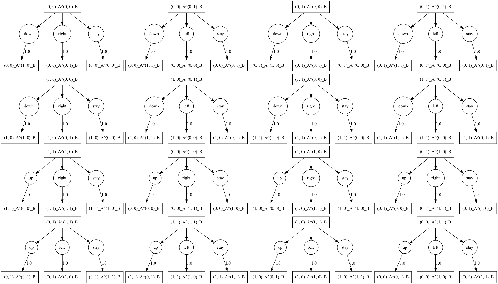
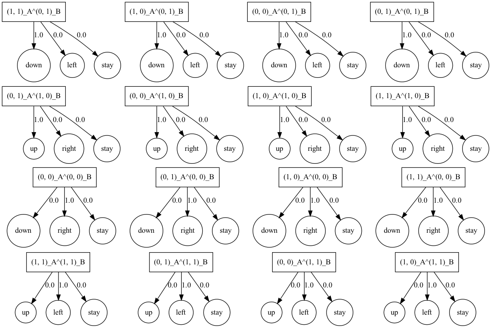

# POWER experiments

(Work in progress.)

Reference paper: _[Optimal policies tend to seek power](https://arxiv.org/pdf/1912.01683v7.pdf)_.

Investigation of the following MDP (Figure 1 from the paper):


## Installation, setup, and testing

👉 _This repo has only been tested with Python 3.8.9._

1. Ensure Homebrew and Graphviz are installed to enable MDP visualization. Run:
  
    ```
    % /bin/bash -c "$(curl -fsSL https://raw.githubusercontent.com/Homebrew/install/HEAD/install.sh)"
    ```

    ```
    % brew install graphviz
    ```

2. Activate `virtualenv`. Run:

    ```
    % python3 -m venv venv
    % source venv/bin/activate
    ```

3. Ensure pip is up to date and download required packages. Run:

    ```
    % pip install --upgrade pip
    % pip install -r requirements.txt
    ```

4. Create a W&B account if you don't have one already. Then create a file in the main directory called `settings.json` with the following format:

    ```
    {
        "public": {
          "WANDB_DEFAULT_ENTITY": $YOUR_WANDB_USERNAME,
        }
        "private": {
            "WANDB_API_KEY": $YOUR_WANDB_KEY
        }
    }
    ```

5. Run the `test_vanilla()` function that will calculate the POWER for each state in the MDP whose `dot` format graph is stored in `mdps/mdp_from_paper.gv`, plot the results, and post them to W&B. Run:

    ```
    % python -i main.py
    ```

    Then:

    ```
    >>> experiment = test.test_vanilla()
    ```

6. Confirm that the output you get is consistent. You should see something like:

    ```
      wandb: Currently logged in as bob-bobson (use `wandb login --relogin` to force relogin)
      wandb: Starting wandb agent 🕵️
      2021-11-23 11:15:03,014 - wandb.wandb_agent - INFO - Running runs: []
      2021-11-23 11:15:03,340 - wandb.wandb_agent - INFO - Agent received command: run
      2021-11-23 11:15:03,341 - wandb.wandb_agent - INFO - Agent starting run with config:
              mdp_graph: mdp_from_paper
              convergence_threshold: 0.0001
              discount_rate: [0.1, '0p1']
              num_reward_samples: 10000
              num_workers: 10
              random_seed: None
              reward_distribution: {'default_dist': {'dist_name': 'uniform', 'params': [0, 1]}, 'state_dists': {'ℓ_◁': {'dist_name': 'uniform', 'params': [-2, 0]}, '∅': {'dist_name': 'uniform', 'params': [-1, 1]}}}
      2021-11-23 11:15:03,345 - wandb.wandb_agent - INFO - About to run command: /usr/bin/env python sweep.py --mdp_graph=mdp_from_paper --convergence_threshold=0.0001 "--discount_rate=[0.1, '0p1']" --num_reward_samples=10000 --num_workers=10 --random_seed=None "--reward_distribution={'default_dist': {'dist_name': 'uniform', 'params': [0, 1]}, 'state_dists': {'ℓ_◁': {'dist_name': 'uniform', 'params': [-2, 0]}, '∅': {'dist_name': 'uniform', 'params': [-1, 1]}}}"
      wandb: Currently logged in as bob-bobson (use `wandb login --relogin` to force relogin)
      wandb: Tracking run with wandb version 0.12.7
      wandb: Syncing run ethereal-sweep-1
      wandb:  View project at https://wandb.ai/bob-bobson/uncategorized
      wandb:  View sweep at https://wandb.ai/bob-bobson/uncategorized/sweeps/1plu2i6a
      wandb:  View run at https://wandb.ai/bob-bobson/uncategorized/runs/93g2c7ow
      wandb: Run data is saved locally in /Users/bobbobson/filepath/power-paper-mdp/wandb/run-20211123_111504-93g2c7ow
      wandb: Run `wandb offline` to turn off syncing.

      Running samples 10000 / 10000

      Run complete.

      Rendering plots...

      [...etc...]

      wandb: Waiting for W&B process to finish, PID 26234... (success).
      wandb:                                                                                
      wandb: Synced 5 W&B file(s), 11 media file(s), 0 artifact file(s) and 0 other file(s)
      wandb: Synced cerulean-sweep-3: https://wandb.ai/bob-bobson/uncategorized/runs/7hww51de
      wandb: Find logs at: ./wandb/run-20211123_111547-7hww51de/logs/debug.log
      wandb: 
      2021-11-23 11:16:07,319 - wandb.wandb_agent - INFO - Cleaning up finished run: 7hww51de
      2021-11-23 11:16:08,012 - wandb.wandb_agent - INFO - Agent received command: exit
      2021-11-23 11:16:08,013 - wandb.wandb_agent - INFO - Received exit command. Killing runs and quitting.
      wandb: Terminating and syncing runs. Press ctrl-c to kill.
    ```

    Navigating to your Sweeps view (using the link above under "View sweep at") should show the following:

    

    This sweep iterates over three discount rate values: 0.1, 0.3, and 0.5. The config YAML file for the test sweep is located at `configs/test_sweep.yaml`.

7. Repeat steps 5 and 6 for the three other available test functions: `test_gridworld()` (which tests the ability to run and visualize gridworlds), `test_stochastic()` (which tests the simulation loop with stochastic MDPs), and `test_multiagent()` (which tests the simulation loop in multiagent settings).

## Usage

### Running an experiment

🟣 To run an experiment, use the `launch.launch_sweep()` function. This function takes a config filename as its only required argument. The config file is a YAML file that contains the parameters for the experiment.

For example:

  ```
  >>> launch.launch_sweep('test_sweep.yaml')
  ```

The YAML file is the canonical description of the sweep for your experiment, and YAML files corresponding to individual runs of your sweep are saved in the `expts` and `wandb` directories.

🔵 Here are the input arguments to `launch_sweep()` and what they mean (the YAML API is described afterwards):

(Listed as `name [type] (default): description`.)

- `sweep_config_filename [str, required]`: The name of the YAML file that contains the configuration for your sweep. This file should be located in the `configs` directory, but you don't need to include the `configs/` prefix in the filename.

  Typical value: `'test_sweep.yaml'`

- `sweep_local_id [str] (time.strftime('%Y%m%d%H%M%S', time.localtime(time.time())))`: A unique identifier for your sweep. This is used to name the directory in which the sweep and its runs are saved. This id will also show up in the names of your runs in the W&B UI.

  Typical value: `20211123111452`

- `entity [str] (data.get_settings_value(data.WANDB_ENTITY_PATH, settings_filename=data.SETTINGS_FILENAME))`: The W&B entity that is running the sweep. This is used to properly save your sweep in W&B.

  Typical value: `'bob-bobson'`

- `project [str] ('uncategorized')`: The W&B project that is running the sweep. This is used to properly save your sweep in W&B. If a project of that name is not owned by the same `entity` that is running the sweep, a new project will be created.

  Typical value: `'uncategorized'`

- `sweep_config_folder [str] (data.SWEEP_CONFIGS_FOLDER)`: The folder in which the sweep config file is located. This is used to find the config file.

  Typical value: `'configs'`

- `output_folder_local [str] (data.EXPERIMENT_FOLDER)`: The folder in which the experiment and its runs will be saved.

  Typical value: `'expts'`

- `plot_as_gridworld [bool] (False)`: Whether to visualize the POWER plots on a gridworld. Note that if you aren't running a gridworld MDP, setting this to `True` will crash the run.

  Typical value: `False`

- `plot_correlations [bool] (False)`: Whether to visualize the correlation plots. Sometimes you have so many states that all the correlation plots don't render in reasonable time during the sweep (because if there are `N` states, there are `N^2` correlation plots).

  Typical value: `False`

- `beep_when_done [bool] (False)`: Exactly what it sounds like.

  Typical value: `False`

- `environ [environ] (os.environ)`: The complete shell environment of the run; includes the environment variables that will be used to run the experiment. In general you shouldn't need to change this.

  Typical value: `environ({ 'USER': 'bob_bobson', ... })`

You can find examples of sweep configuration files in the `configs` folder. The file `test_sweep.yaml` defines a sweep for the single-agent case, with a single Agent A MDP graph given by the parameter `mdp_graph` (see below). The file `test_run_multi_actual.yaml` defines a single run for the multi-agent case, with an Agent A MDP graph given by `mdp_graph_agent_A`, and Agent B MDP graph given by `mdp_graph_agent_B`, and an Agent B fixed policy graph given by `policy_graph_agent_B`.

Here are the entries of the sweep YAML file:

- `name [str]`: The name of your sweep, typically separated by underscores.

  Typical value: `'test_sweep'`

- `description [str]`: A description of your sweep.

  Typical value: `'This is a test sweep.'`

- `program`: The Python script that runs your sweep. This should always be set to `'sweep.py'`.

  Typical value: `'sweep.py'`

- `parameters`: A series of entries and values that define the sweep. Includes fixed values and values that vary over the sweep. Below are the parameters and their syntax **for fixed values**:

  - (Single-agent only) `mdp_graph`: The name of the file in the `mdps` folder that corresponds to the MDP graph you want to use. This name should not include the `.gv` extension. **Do not include this parameter if you are running a multi-agent sweep.**

    Typical value: `'mdp_from_paper'`
  
  - (Multi-agent only) `mdp_graph_agent_A`: The name of the file in the `mdps` folder that corresponds to the MDP graph you want to use for Agent A. This name should not include the `.gv` extension. **Do not include this parameter if you are running a single-agent sweep.**

    Typical value: `'stoch_gridworld_1x3_agent_A'`
  
  - (Multi-agent only) `mdp_graph_agent_B`: The name of the file in the `mdps` folder that corresponds to the MDP graph you want to use for Agent B. This name should not include the `.gv` extension. **Do not include this parameter if you are running a single-agent sweep.**
  
    Typical value: `'stoch_gridworld_1x3_agent_B'`
  
  - (Multi-agent only) `policy_graph_agent_B`: The name of the file in the `policies` folder that corresponds to the policy graph you want to use for Agent B. This name should not include the `.gv` extension. **Do not include this parameter if you are running a single-agent sweep.**
    
    Typical value: `'stoch_gridworld_1x3_agent_B_move_left'`
  
  - `discount_rate`: The discount rate for the MDP.

    Typical value: `0.1`
  
  - `reward_distribution`: A list of distributions for the reward of each state. We have one `default_dist`, which defines the default reward distribution and is assumed to be iid over all states, and we also have a list of `state_dists`, which define state-specific reward distributions for all states that do not have the default distribution. Each distribution is defined by a `dist_name`, which is the name of that base distribution as found in `DISTRIBUTION_DICT` in `utils/dist.py`; and a `params` list, which is a list of parameters for that distribution.

    Typical value:

    ```
    default_dist:
        dist_name:
          "uniform"
        params:
          [0, 1]
      state_dists:
        "∅":
          dist_name:
            "uniform"
          params:
            [-1, 1]
        "ℓ_◁":
          dist_name:
            "uniform"
          params:
            [-2, 0]
    ```
  
  - `num_reward_samples`: The number of samples to draw from the reward distribution for each state in the POWER calculations.

    Typical value: `10000`
  
  - `convergence_threshold`: The convergence threshold for the value iteration algorithm.

    Typical value: `0.0001`
  
  - `num_workers`: The number of workers to use in multiprocessing.

    Typical value: `10`
  
  - `random_seed`: The random seed to use for the experiment. If `null`, then the random seed is not fixed. Normally set to a number, to make it easier to reproduce the experiment later.

    Typical value: `0`

  Note that the above parameter values are set with different syntax depending on whether the value is **fixed**, or whether it **varies** over the course of the sweep. If the value is **fixed**, then the syntax puts the actual value of the parameter _under a `value` key_ in the parameter dictionary, like so:

  ```
  discount_rate:
    value:
      0.1
  ```

  If the value **varies**, then the parameter takes on multiple values over the course of a sweep. The way to specify this is to create a `values` key under which you list each value of the parameter, _and also a `names` key_ under which you list the names of the corresponding values in order to allow each run of your sweep to be named according to the parameter values it corresponds to. For example:

  ```
  discount_rate:
    values:
      - 0.1
      - 0.2
      - 0.3
    names:
      - "0p1"
      - "0p2"
      - "0p3"
  ```

  (Note that it's best to use "p" instead of "." for decimals, since the parameter names are going to be used in filenames.)

🟢 The `launch.launch_sweep()` function returns no output. Instead, it saves the results of the sweep to the `output_folder_local` folder, and to the `/wandb` folder. The rendered correlation plots associated with each run of the sweep are saved in a subfolder that corresponds to their run.

## Saving and loading MDP graphs

🟣 To save a new MDP graph for later experiments, use `data.save_graph_to_dot_file()` to save a NetworkX graph as a `dot` file in a target folder. For example, the following code creates and saves the MDP graph from Figure 1 of _Optimal policies tend to seek power_:

```
>>> import networkx as nx
>>> new_mdp = nx.DiGraph([
        ('★', '∅'), ('★', 'ℓ_◁'), ('★', 'r_▷'),
        ('∅', '∅'),
        ('ℓ_◁', 'ℓ_↖'), ('ℓ_◁', 'ℓ_↙'),
        ('ℓ_↙', 'ℓ_↖'), ('ℓ_↙', 'ℓ_↙'),
        ('r_▷', 'r_↗'), ('r_▷', 'r_↘'),
        ('r_↘', 'r_↘'), ('r_↘', 'r_↗'),
        ('r_↗', 'r_↗'), ('r_↗', 'r_↘'),
        ('ℓ_↖', 'ℓ_↙'))
    ], name='POWER paper MDP')
>>> data.save_graph_to_dot_file(new_mdp, 'mdp_from_paper')
```

🔵 Here are the input arguments to `data.save_graph_to_dot_file()` and what they mean:

(Listed as `name [type] (default): description`.)

- `mdp_graph [networkx.DiGraph, required]`: The NetworkX [DiGraph](https://networkx.org/documentation/stable/reference/classes/digraph.html) you want to save as your MDP. This should be a directed graph, with nodes representing states and edges representing transitions. Every state must have at least one outgoing edge, even if the state points to itself (i.e., the state has a self-loop).

  Typical value: `mdp.quick_graph_to_mdp(nx.petersen_graph(), name='Petersen graph')`

- `mdp_filename [str, required]`: The name of the file to save the MDP graph as. This should be a filename without an extension, and should be unique among all MDP graphs you have saved. (If the name you save with is the same as the name of an existing file, this will overwrite the existing file without warning.)

  Typical value: `'petersen_graph'`

- `folder [str] (data.MDPS_FOLDER)`: The folder to save the graph in. Note that you can save policy graphs in the same way as MDP graphs, and if so, you should generally save these in the `policies` folder.

  Typical value: `'mdps'`

🟢 The `data.save_graph_to_dot_file()` function returns no output. Instead, it saves the MDP graph to the `data.MDPS_FOLDER` folder for future use.

🟣 To load a previously saved NetworkX graph, use `data.load_graph_from_dot_file()`. For example, the following code loads the MDP graph that's used in the `test.test_vanilla()` integration test:

```
>>> new_mdp = data.load_graph_from_dot_file('mdp_from_paper')
```

🔵 Here are the input arguments to `data.load_graph_from_dot_file()` and what they mean:

(Listed as `name [type] (default): description`.)

- `mdp_name [str, required]`: The file name of the graph you want to load. This **should not** include the `.gv` extension.

  Typical value: `'mdp_from_paper'`

- `folder [str] (data.MDPS_FOLDER)`: The folder to load the graph from. Note that you can load policy graphs with this function too; if you're doing that, you should load them from the `policies` folder. 

  Typical value: `'mdps'`

🟢 Here is the output to `data.load_graph_from_dot_file()`:

- `output_graph [networkx.DiGraph]`: The loaded NetworkX graph. This may be either an MDP or a policy graph.

## Creating a simple MDP graph

🟣 You can create any kind of simple MDP graph manually by directly calling the NetworkX `DiGraph()` API. For example, the following code creates the MDP graph from Figure 1 of _Optimal policies tend to seek power_:

```
>>> import networkx as nx
>>> new_mdp = nx.DiGraph([
        ('★', '∅'), ('★', 'ℓ_◁'), ('★', 'r_▷'),
        ('∅', '∅'),
        ('ℓ_◁', 'ℓ_↖'), ('ℓ_◁', 'ℓ_↙'),
        ('ℓ_↙', 'ℓ_↖'), ('ℓ_↙', 'ℓ_↙'),
        ('r_▷', 'r_↗'), ('r_▷', 'r_↘'),
        ('r_↘', 'r_↘'), ('r_↘', 'r_↗'),
        ('r_↗', 'r_↗'), ('r_↗', 'r_↘'),
        ('ℓ_↖', 'ℓ_↙'))
    ], name='POWER paper MDP')
```

For full documentation on the NetworkX `DiGraph()` API, see [here](https://networkx.org/documentation/stable/reference/classes/digraph.html).

🟣 For quick tests, you can use one of the [prepackaged NetworkX graph topologies](https://networkx.org/documentation/stable/tutorial.html?highlight=petersen_graph#graph-generators-and-graph-operations) (such as the Petersen graph), and convert these to a compatible directed graph using `mdp.quick_graph_to_mdp()`:

  ```
  >>> import networkx as nx
  >>> petersen_mdp = mdp.quick_graph_to_mdp(nx.petersen_graph(), name='Petersen graph')
  ```

🔵 Here are the input arguments to `mdp.quick_graph_to_mdp()` and what they mean:

(Listed as `name [type] (default): description`.)

- `mdp_graph [networkx.Graph OR networkx.DiGraph, required]`: The NetworkX graph you want to convert. This can be either a `Graph` or a `DiGraph`. In either case, it will be converted to a `DiGraph`. You'll often want to use some of the pre-packaged NetworkX graphs as input for quick testing.

  Typical value: `nx.petersen_graph()`

- `name [str] ('')`: The name you want to give the output graph.

  Typical value: `'Petersen graph'`

🟢 Here is the output to `mdp.quick_graph_to_mdp()`:

- `output_graph [networkx.DiGraph]`: The output NetworkX `DiGraph`. Note that using `quick_graph_to_mdp()` on an undirected graph makes the resulting output graph not just _directed_, but also _acyclic_. It also makes sure that every non-terminal node has at least one outbound edge or self-loop.

## Creating a gridworld MDP graph

🟣 To create a gridworld MDP, use `mdp.construct_gridworld()`. For example, the following code creates the gridworld pictured below:

```
>>> gridworld = mdp.construct_gridworld(10, 10, squares_to_delete=[['(0, 0)', '(3, 2)'], ['(6, 4)', '(8, 7)']])
```


🔵 Here are the input arguments to `mdp.construct_gridworld()` and what they mean:

(Listed as `name [type] (default): description`.)

- `num_rows [int, required]`: The maximum number of rows in your gridworld.

  Typical value: `5`

- `num_cols [int, required]`: The maximum number of columns in your gridworld.

  Typical value: `5`

- `name [str] ('custom gridworld')`: The name you want to give your gridworld.

  Typical value: `'3x3 gridworld'`

- `squares_to_delete [list] ([])`: A list of 2-tuples, where each 2-tuple is a pair of coordinates (in **string** format) for the edges of a square you want to delete from your gridworld. For example, if you want to delete the square with the top-left corner at (0, 0) and the bottom-right corner at (2, 2), then you would use `squares_to_delete=[['(0, 0)', '(2, 2)']]`. This format allows us to quickly construct gridworlds with interesting structures.

  Typical value: `[['(0, 0)', '(3, 2)'], ['(6, 4)', '(8, 7)']]`

🟢 Here is the output to `mdp.construct_gridworld()`:

- `gridworld_graph [networkx.DiGraph]`: An MDP graph representing the gridworld you created. Each square has a self-loop, and connections to the squares above, beneath, to the left, and to the right of it (if they exist).

  The states of the gridworld MDP are strings indicating the coordinates of each cell in the gridworld. For example, the state `'(0, 0)'` represents the cell at the top-left corner of the gridworld.

## Creating a stochastic MDP graph

🟣 To create a stochastic MDP, start from an existing MDP graph and use `mdp.mdp_to_stochastic_graph()`. For example, the following code changes the simple `gridworld_selfloop_3x3` graph to a stochastic format:

``` 
>>> stochastic_mdp = mdp.mdp_to_stochastic_graph(data.load_graph_from_dot_file('gridworld_selfloop_3x3'))
```

🔵 Here are the input arguments to `mdp.mdp_to_stochastic_graph()` and what they mean:

(Listed as `name [type] (default): description`.)

- `mdp_graph [networkx.DiGraph, required]`: The NetworkX [DiGraph](https://networkx.org/documentation/stable/reference/classes/digraph.html) you want to convert into stochastic format. It should have a graph structure like this:

  
  
  Here the ovals represent states and the arrows represent transitions. The states are labeled with their names; the MDP above is a representation of the 3x3 gridworld. Note that all of the states have self-loops.

  Typical value: `data.load_graph_from_dot_file('gridworld_selfloop_3x3')`

🟢 Here is the output to `mdp.mdp_to_stochastic_graph()`:

- `stochastic_graph [networkx.DiGraph]`: A NetworkX graph representing the new MDP, in stochastic format. This format explicitly represents the transition probabilities from one state to another in the graph. Here is an example:

  

  Here the squares represent states, the circles represent actions, and the arrows represent transitions. The numbers on each arrow represent the probability of that action-state transition.

🟣 To convert a **gridworld** specifically to a stochastic graph, you'll typically want to use `mdp.gridworld_to_stochastic_graph()`. This is a more powerful function than `mdp.mdp_to_stochastic_graph()`, because it includes options for adding stochastic noise to some of the gridworld state transitions — but it's limited to taking gridworlds as inputs, rather than general MDPs. For example, the following code takes the simple `gridworld_selfloop_3x3` gridworld MDP, and converts it into a gridworld with left-facing stochastic "wind" in all cells:

``` 
>>> stochastic_gw_with_left_wind = mdp.gridworld_to_stochastic_graph(data.load_graph_from_dot_file('gridworld_selfloop_3x3'), stochastic_noise_level=0.2, noise_bias={ 'left': 0.2 })
```

🔵 Here are the input arguments to `mdp.gridworld_to_stochastic_graph()` and what they mean:

(Listed as `name [type] (default): description`.)

- `mdp_graph [networkx.DiGraph, required]`: The NetworkX gridworld [DiGraph](https://networkx.org/documentation/stable/reference/classes/digraph.html) you want to convert into stochastic format.

  Typical value: `data.load_graph_from_dot_file('gridworld_selfloop_3x3')`

🟢 Here is the output to `mdp.mdp_to_stochastic_graph()`:

- `stochastic_graph [networkx.DiGraph]`: A NetworkX graph representing the new gridworld MDP, in stochastic format. This format explicitly represents the transition probabilities from one state to another in the graph. Here is an example:

  

  Here the squares represent states, the circles represent actions, and the arrows represent transitions. The numbers on each arrow represent the probability of that action-state transition.

🟣 To add a state (and its downstream actions) to a stochastic MDP, start from an existing stochastic MDP, and use use `mdp.add_state_action()`. For example, the following code adds a state with actions `'L'`, `'H'`, and `'R'` to the MDP graph:

```
>>> stochastic_mdp = mdp.add_state_action(nx.DiGraph(), '2', {
        'L': { '1': 1 },
        'H': { '1': 0.5, '2': 0.5 },
        'R': { '2': 0.2, '3': 0.8 }
    })
```

🔵 Here are the input arguments to `mdp.add_state_action()` and what they mean:

(Listed as `name [type] (default): description`.)

- `mdp_graph [networkx.DiGraph, required]`: The NetworkX [DiGraph](https://networkx.org/documentation/stable/reference/classes/digraph.html) you want to add the state to. This should be an MDP in stochastic format, i.e., formatted as in the picture below:

  

  Typical value: `nx.DiGraph()`

- `state_to_add [str, required]`: The state whose outgoing transitions you want to add to the MDP graph.

  Typical value: `'1'`

- `action_dict [dict, required]`: A dictionary of actions and their corresponding transitions. The keys of this dictionary are actions, and the values are dictionaries of states and their corresponding probabilities.

  Typical value:
  ```
    {
        'L': { '1': 1 },
        'H': { '1': 0.5, '2': 0.5 },
        'R': { '2': 0.2, '3': 0.8 }
    }
  ```

- `check_closure [bool] (False)`: Whether or not to throw a warning if the MDP graph is not closed. "Not closed" means that the MDP incldues states that have no outgoing transitions. MDPs that aren't closed can't be used for experiments and will cause an error in POWER sweeps.

  Typical value: `False`

🟢 Here is the output to `mdp.add_state_action()`:

- `new_mdp_graph [networkx.DiGraph]`: An MDP graph representing the new MDP, with the new state, actions, and outgoing transitions added to it.

## Creating a multiagent MDP graph

🟣 You can create a two-agent MDP graph from the perspective of either agent by starting from a "naive" single-agent MDP graph and applying `multi.create_multiagent_transition_graph()` to it. This function takes the state set of the input MDP graph, and takes the outer product of those states by assuming that both Agent A and Agent B are moving on the same state set. So if the original graph was a 1x2 gridworld with cells `'(0, 0)'` and `'(0, 1)'`, the output graph would have states `'(0_A, 0_B)'`, `'(0_A, 1_B)'`, `'(1_A, 0_B)'`, and `'(1_A, 1_B)'`. For example, the following code creates a multiagent MDP graph from the perspective of Agent A, out of a 3x3 gridworld graph in stochastic format:

``` 
>>> mdp_graph_A = multi.create_multiagent_transition_graph(mdp.gridworld_to_stochastic_graph(data.load_graph_from_dot_file('gridworld_selfloop_3x3')), current_agent_is_A=True)
```

🔵 Here are the input arguments to `mdp.create_multiagent_transition_graph()` and what they mean:

(Listed as `name [type] (default): description`.)

- `single_agent_graph [networkx.DiGraph, required]`: The single-agent MDP graph that you want to convert into multiagent format. **This graph should already be in stochastic format,** so if it isn't, you should apply either `mdp.mdp_to_stochastic_graph()` or `mdp.gridworld_to_stochastic_graph()` to it first (depending on whether the original is a gridworld or not).

  Typical value: `mdp.gridworld_to_stochastic_graph(data.load_graph_from_dot_file('gridworld_selfloop_3x3'))`

- `current_agent_is_A [bool] (True)`: Set this to `True` if you want the output multiagent graph to be from the perspective of Agent A, and `False` if you want it from the perspective of Agent B. The agent you pick will be the one whose actions will affect the states; so if you choose the perspective of Agent A, your output graph will have transitions like `'(0_A, 0_B)' == 'right' ==> '(1_A, 0_B)'`, but will _not_ have transitions like `'(0_A, 0_B)' == 'right' ==> '(0_A, 1_B)'`.

  Typical value: `True`

🟢 Here is the output to `mdp.create_multiagent_transition_graph()`:

- `multiagent_graph [networkx.DiGraph]`: A NetworkX graph representing the multiagent MDP from the perspective of the agent you selected in `current_agent_is_A`. This MDP is in stochastic format, and its states are the outer product of Agent A and Agent B positional states. Here is an example of a multiagent MDP from the perspective of Agent A:

  

  And here is an example of a multiagent MDP from the perspective of Agent B:

  

  These MDPs represent two agents on the same underlying state set: a 2x2 gridworld. Notice that the joint states of A and B are labelled as, e.g., `(0, 0)_A^(0, 0)_B`. This is the standard notation that's used under the hood to label joint states in a multiagent system.

## Creating a fixed policy graph

🟣 To run a multiagent experiment, you need to create a fixed policy for Agent B — otherwise the state transitions from the perspective of Agent A won't be fully defined. You can quickly create a random policy for Agent B using the `policy.quick_mdp_to_policy()` function. (You have to apply this function to an MDP **over joint states** that's **from the perspective of the agent you want the policy to be for** — in practice, that means you apply this to the output of the `multi.create_multiagent_transition_graph()` function.) For example, the following code creates a random Agent B policy over the 3x3 gridworld graph:

``` 
>>> policy_B = policy.quick_mdp_to_policy(multi.create_multiagent_transition_graph(mdp.gridworld_to_stochastic_graph(data.load_graph_from_dot_file('gridworld_selfloop_3x3')), current_agent_is_A=False))
```

Notice that `current_agent_is_A` is set to `False`, which is what defines this policy as being as belonging to Agent B.

🔵 Here are the input arguments to `mdp.quick_mdp_to_policy()` and what they mean:

(Listed as `name [type] (default): description`.)

- `mdp_graph [networkx.DiGraph, required]`: The MDP graph over joint states, from the perspective of the agent whose policy you want as output. Normally this will be the output of a call to the `multi.create_multiagent_transition_graph()` function.

  Typical value: `multi.create_multiagent_transition_graph(mdp.gridworld_to_stochastic_graph(data.load_graph_from_dot_file('gridworld_selfloop_3x3')), current_agent_is_A=False)`

🟢 Here is the output to `mdp.quick_mdp_to_policy()`:

- `policy_graph [networkx.DiGraph]`: A NetworkX graph representing the policy of the agent whose perspective the input MDP graph was from. The policy graph format is pretty similar to the MDP graph format. Here's an example, for an Agent B policy:

  

  As you'd expect, the rectangles represent joint states, the circles represent actions, and the arrows represent transitions. The numbers on each arrow represent the probability of taking a given action from a given state, under that policy. (Note that the output of `mdp.quick_mdp_to_policy()` will be a _random_ policy, with equal probabilities of each action from a given state, while the example shown above is deterministic.)

🟣 The `policy.quick_mdp_to_policy()` function returns a random policy. But in general, we want to test all sorts of different policies in our multiagent runs. The way to do this is to start from a random policy, and run `policy.update_state_actions()` on it until you end up with the policy you want. For example, the following code updates the Agent B random policy on a 3x3 gridworld to deterministically move to the right when A and B are both at cell `(0, 0)`:

``` 
>>> policy_B_right = policy.update_state_actions(policy.quick_mdp_to_policy(multi.create_multiagent_transition_graph(mdp.gridworld_to_stochastic_graph(data.load_graph_from_dot_file('gridworld_selfloop_3x3')), current_agent_is_A=False)), '(0 ,0)_A^(0, 0)_B', { 'right': 1, 'down': 0, 'stay': 0 })
```

🔵 Here are the input arguments to `mdp.update_state_actions()` and what they mean:

(Listed as `name [type] (default): description`.)

- `policy_graph [networkx.DiGraph, required]`: The policy graph you want to update.

  Typical value: `policy.quick_mdp_to_policy(multi.create_multiagent_transition_graph(mdp.gridworld_to_stochastic_graph(data.load_graph_from_dot_file('gridworld_selfloop_3x3')), current_agent_is_A=False))`

- `state [str, required]`: The state whose action probabilities you want to update in your new policy.

  Typical value: `'(0, 0)_A^(0, 0)_B'`

- `new_policy_actions [dict, required]`: A dictionary listing all the allowed actions from `state`, along with the probabilities you want to assign to them under the new policy. You need to list _all_ the allowed actions from `state`, and assign them _all_ new probabilities that, of course total to 1.

  Typical value: `{ 'right': 1, 'down': 0, 'stay': 0 }`

🟢 Here is the output to `mdp.update_state_actions()`:

- `policy_graph [networkx.DiGraph]`: The NetworkX graph representing the new policy after the update. This will have exactly the same format (and the same state set) as the input policy graph, just with the action probabilities from the target state modified according to the `new_policy_actions` dict you assigned.