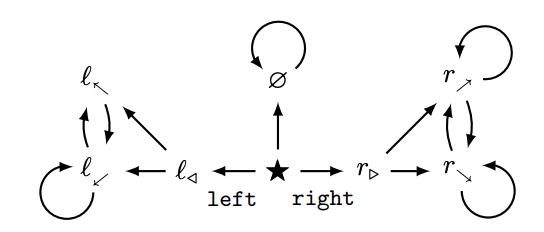
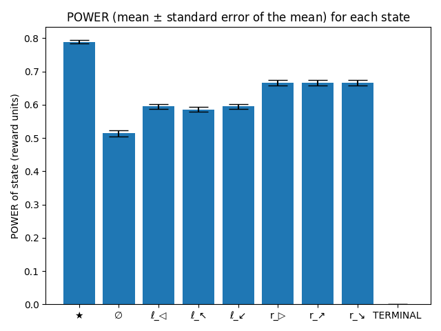
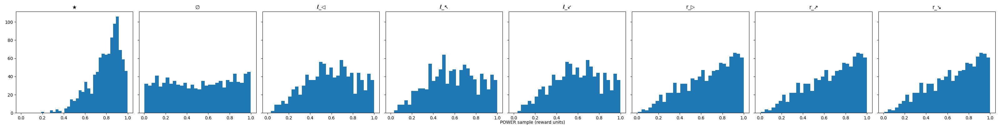
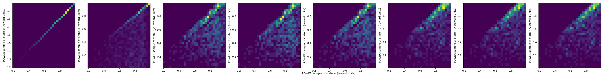
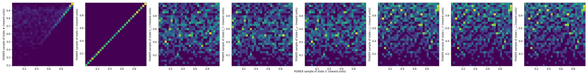
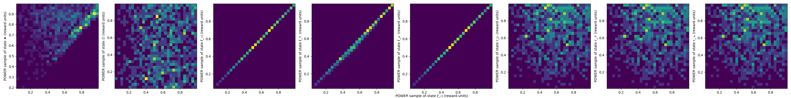
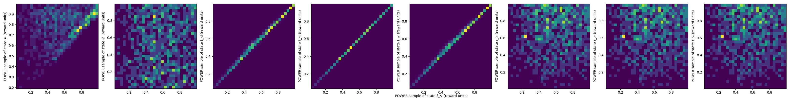
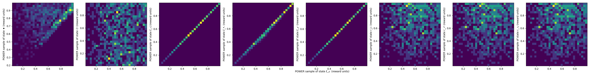
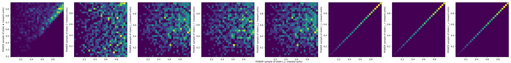
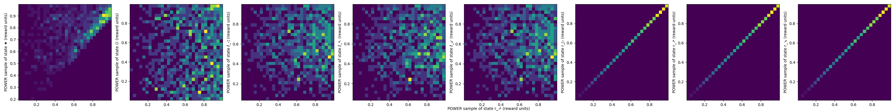

# POWER experiments

(Work in progress.)

Reference paper: _[Optimal policies tend to seek power](https://arxiv.org/pdf/1912.01683v7.pdf)_.

Investigation of the following MDP (Figure 1 from the paper):



## Installation, setup, and testing

👉 _This repo will only work with Python 3._

1. Activate `virtualenv`. Run:

  ```
  % python3 -m venv venv
  % source venv/bin/activate
  ```

2. Ensure pip is up to date and download required packages. Run:

  ```
  % pip install --upgrade pip
  % pip install -r requirements.txt
  ```

3. Run the `test()` function that will calculate and plot the POWER for each state in the MDP with adjacency matrix given by `data.ADJACENCY_MATRIX`. Run:

  ```
  % python -i main.py
  ```

  Then:

  ```
  >>> experiment = test()
  ```

4. Confirm that the output you get is consistent. You should see something like:

  ```
    Running samples 123 / 1000
  ```

  The test function should then show 10 plots that looks like this:

  
  
  
  
  
  
  
  
  
  
